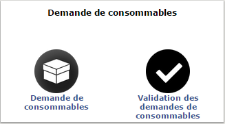
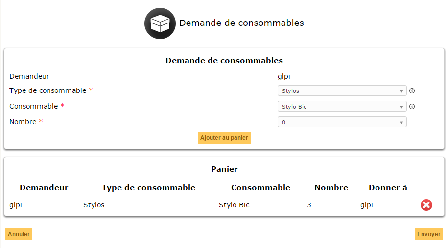

## Consumables plugin for GLPI

### Français

Ce plugin vous permet de gérer les demandes de consommables pour les utilisateur finaux.
* Système de validation de demande de consommables
* Notifications associées
* Wizard utilisateur basé sur le stock disponible

